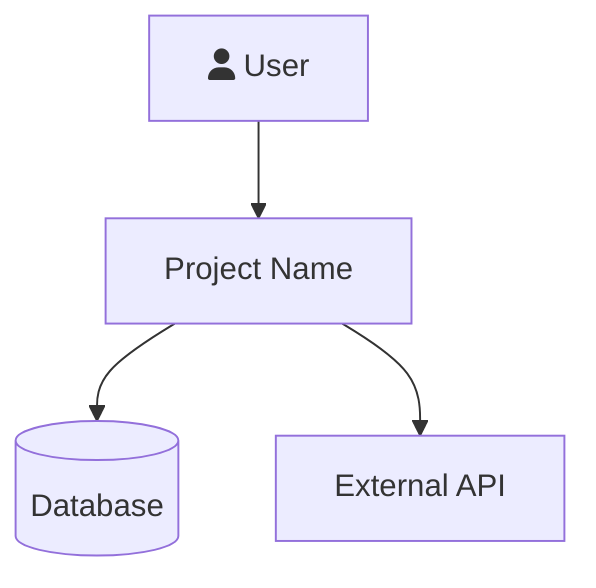
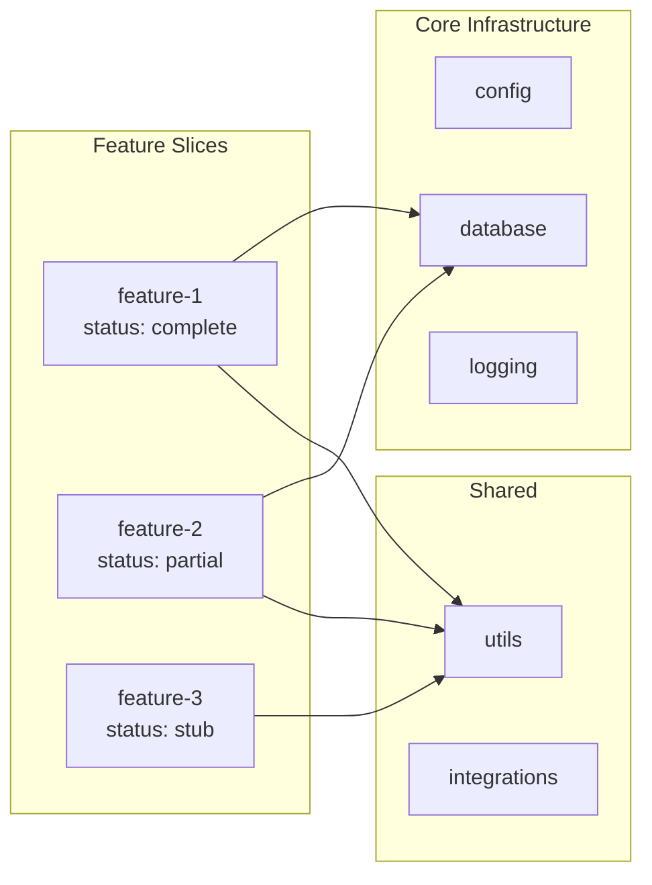

# Vertical Slice Architecture Patterns

Reference for analyzing VSA codebases. Use to identify slice boundaries, assess completeness, and detect architectural violations.

## VSA Structure

```
project/
├── core/              # Universal infrastructure (config, db, logging, middleware)
├── shared/            # Cross-feature utilities (3+ features use it)
├── {feature}/         # Self-contained feature slices
│   ├── routes.*       # API endpoints / page handlers
│   ├── service.*      # Business logic
│   ├── repository.*   # Data access layer
│   ├── models.*       # Database models / ORM
│   ├── schemas.*      # Request/response validation (Pydantic, Zod, etc.)
│   ├── exceptions.*   # Feature-specific errors
│   ├── validators.*   # Optional: complex validation
│   ├── cache.*        # Optional: feature caching
│   ├── tasks.*        # Optional: background jobs
│   └── test_*         # Co-located tests
└── tests/             # Integration / e2e tests
```

## Detection Heuristics

### Identify Feature Slices
- Directories containing 2+ of: routes/router/controller, service, model/schema
- Each slice should be independently understandable
- Flow: Routes → Service → Repository → Database

### Assess Slice Completeness
For each detected slice, check presence of:
- **Required**: routes, service, schemas (minimum viable slice)
- **Expected**: models/repository (if slice touches DB)
- **Good practice**: exceptions, tests
- **Optional**: validators, cache, tasks, README

Rate: Complete (all required+expected), Partial (missing expected), Stub (only 1-2 files)

### Detect Architecture Violations
- **Cross-slice imports**: Feature A importing from Feature B's internals (should go through shared/ or events)
- **Fat core**: core/ containing business logic (should only be infrastructure)
- **Premature shared/**: Code in shared/ used by fewer than 3 features
- **Scattered concerns**: Business logic in routes (should be in service)
- **Missing boundaries**: No clear separation between service and repository layers

### Assess core/ Health
Should contain only: config, database, logging, middleware, exceptions, dependencies, events
Red flag: any feature-specific logic in core/

### Assess shared/ Health
Apply the three-feature rule: every file in shared/ should be imported by 3+ feature slices.
Red flag: shared/ code imported by only 1-2 features (premature abstraction)

## Next.js + Convex VSA Variant

For the user's primary stack (Next.js + Convex):

```
src/
├── app/                    # Next.js App Router (routes)
│   ├── (auth)/             # Route group: auth-required pages
│   ├── (public)/           # Route group: public pages
│   └── api/                # API routes (if needed beyond Convex)
├── features/               # Feature slices
│   ├── {feature}/
│   │   ├── components/     # Feature UI components
│   │   ├── hooks/          # Feature React hooks
│   │   ├── actions.ts      # Convex actions
│   │   ├── queries.ts      # Convex queries
│   │   ├── mutations.ts    # Convex mutations
│   │   ├── schema.ts       # Convex schema for this feature
│   │   └── types.ts        # TypeScript types
├── components/             # Shared UI (used by 3+ features)
├── lib/                    # Shared utilities
└── convex/                 # Convex backend
    ├── schema.ts           # Combined schema
    ├── {feature}.ts        # Feature-specific Convex functions
    └── _generated/         # Auto-generated
```

## Mermaid Templates

### C4 Level 1 (System Context)


### C4 Level 2 (Container / Slice Map)


Color-code by slice status:
- `classDef complete fill:#065f46,stroke:#34d399,color:#d1fae5`
- `classDef partial fill:#92400e,stroke:#fbbf24,color:#fef3c7`
- `classDef stub fill:#991b1b,stroke:#f87171,color:#fee2e2`
- `classDef missing fill:#374151,stroke:#6b7280,color:#9ca3af`
