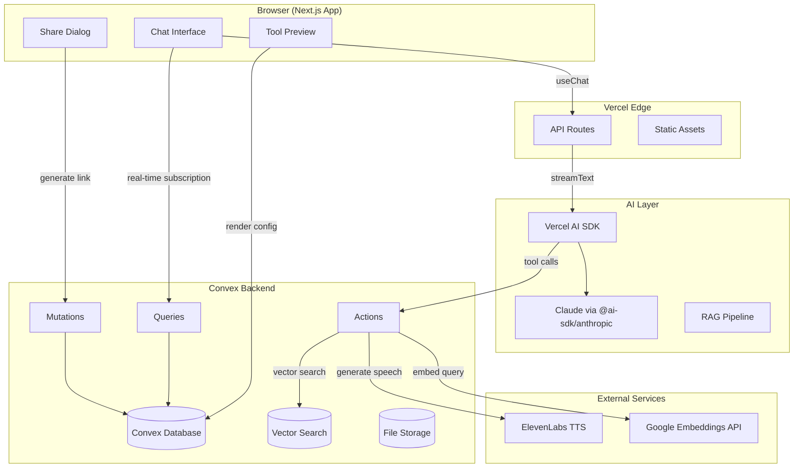

# PRD — Bridges

## 1. Overview

### Product Summary

**Bridges** — Bridges lets autism therapists and parents build their own therapy tools using AI — no coding needed.

Bridges is a web-based platform where parents of autistic children, ABA therapists, and speech-language pathologists describe the therapy tools they need in plain language. An AI agent — pre-loaded with deep therapy domain knowledge — interprets their description, generates a tool configuration, and renders a working, interactive therapy tool in seconds. Tools are shareable via link and work on any device.

### Objective

This PRD covers the MVP as defined for the Springfield Vibeathon (March 23–27, 2026): a working conversational tool builder with 5 pre-built therapy components, therapy-aware RAG, text-to-speech on communication boards, shareable links, and chat-based customization. No auth, no payments, no video analysis.

### Market Differentiation

The technical implementation must deliver three things to achieve Bridges' differentiation: (1) therapy domain intelligence — the AI must understand ABA terminology, speech therapy concepts, and developmental milestones without the user needing to explain them, (2) sub-30-second generation — from description to interactive tool in under 30 seconds, enabled by config-based rendering rather than code generation, and (3) zero-friction sharing — a single link that works on any device without sign-up, install, or app store.

### Magic Moment

A parent types "I need something to help my son practice requesting snacks." Within 30 seconds, they're looking at a working communication board with picture cards, a sentence strip, and text-to-speech that says "I want goldfish crackers" when tapped. The technical requirements for this moment: streaming AI response with <3 second first-token latency, config-to-render pipeline under 500ms, TTS audio playback under 2 seconds, and a shareable URL generated instantly.

### Success Criteria

- Time from first message to working tool preview: < 60 seconds
- Tool rendering from config: < 500ms
- TTS audio generation: < 2 seconds
- Page load (LCP): < 2 seconds on 4G connection
- All 5 therapy components functional and interactive
- Shareable links work across Chrome, Safari, Firefox on mobile and desktop
- RAG retrieval returns relevant therapy context for common ABA/speech therapy terms

---

## 2. Technical Architecture

### Architecture Overview



### Chosen Stack

| Layer | Choice | Rationale |
|-------|--------|-----------|
| Frontend | Next.js | Largest ecosystem, best AI coding tool support, excellent Convex integration, deploys instantly to Vercel |
| Backend | Convex | Real-time reactivity for live tool previews, zero backend boilerplate, built-in vector search for RAG, TypeScript end-to-end |
| Database | Convex Database | Included with Convex, document-relational, automatic indexing, ACID transactions, built-in vector search |
| Auth | Clerk (deferred) | Pre-built UI components, social login, org management. Implemented last to avoid E2E testing friction. |
| Payments | Stripe (post-hackathon) | Industry standard. Not needed for hackathon demo. |
| Deployment | Vercel | One-click Next.js deploy, preview URLs, edge functions |
| AI Chat/Streaming | Vercel AI SDK (`ai` + `@ai-sdk/anthropic`) | `useChat` hook, streaming, multi-step agent via `maxSteps` |
| LLM | Claude (Sonnet) | Best reasoning for understanding therapy descriptions and generating accurate tool configs |
| Embeddings | Google gemini-embedding-001 | 768-dimension vectors, negligible cost, high quality |
| Vector Search | Convex built-in | No external vector DB needed, integrated with Convex backend |
| TTS | ElevenLabs | Natural-sounding speech for communication boards |

### Stack Integration Guide

**Setup order:**
1. `npx create-next-app@latest` with TypeScript, Tailwind, App Router
2. `npx shadcn@latest init` — configure components/ui
3. `npm create convex@latest` — initialize Convex, set up `convex/` directory
4. `npx shadcn@latest add button card input dialog sheet popover label` — add base components
5. Install AI packages: `npm install ai @ai-sdk/anthropic`
6. Install Google AI: `npm install @ai-sdk/google @google/genai`
7. Install ElevenLabs: `npm install elevenlabs`

**Environment variables:**

```env
# Convex
CONVEX_DEPLOYMENT=             # From Convex dashboard
NEXT_PUBLIC_CONVEX_URL=        # From Convex dashboard

# AI
ANTHROPIC_API_KEY=             # Claude API key

# Embeddings
GOOGLE_API_KEY=                # Google AI API key for gemini-embedding-001

# TTS
ELEVENLABS_API_KEY=            # ElevenLabs API key

# Clerk (deferred)
# NEXT_PUBLIC_CLERK_PUBLISHABLE_KEY=
# CLERK_SECRET_KEY=
```

**Key integration patterns:**

- **Convex + Next.js:** Use `ConvexProvider` in the root layout. All data fetching through `useQuery` and `useMutation` hooks. Server components can use `preloadQuery` for SSR.
- **Convex Agent + AI SDK:** Chat is powered by `@convex-dev/agent` (not a Next.js API route). The agent manages threads, messages, streaming, and tool calling via Convex mutations/actions. Tools invoke Convex functions to persist data and query the RAG pipeline.
- **Convex Actions for external APIs:** All calls to Claude, Google Embeddings, and ElevenLabs happen inside Convex `action` functions (which allow external HTTP calls). Actions use `"use node";` directive.
- **Real-time tool preview:** Tool configs are stored in Convex. The preview component subscribes to the tool config via `useQuery` — when the AI updates the config via mutation, the preview re-renders automatically.

**Common gotchas:**
- Convex functions must be exported (not default exported) to be registered
- Convex actions are NOT transactional — use `ctx.runMutation` inside actions for writes
- `useChat` expects a specific response format — use `toDataStreamResponse()` from the AI SDK
- Vector search is called from actions only (`ctx.vectorSearch`), not from queries or mutations

### Repository Structure

```
bridges/
├── src/
│   ├── app/
│   │   ├── layout.tsx              # Root layout, ConvexProvider, fonts
│   │   ├── page.tsx                # Landing/home page
│   │   ├── builder/
│   │   │   └── page.tsx            # Main builder interface (chat + preview)
│   │   ├── tool/
│   │   │   └── [toolId]/
│   │   │       └── page.tsx        # Shareable tool view (public, no auth)
│   │   ├── templates/
│   │   │   └── page.tsx            # Template gallery
│   │   ├── my-tools/
│   │   │   └── page.tsx            # Saved tools list
│   │   └── api/
│   │       └── chat/
│   │           └── route.ts        # Vercel AI SDK chat endpoint
│   ├── components/
│   │   ├── ui/                     # shadcn/ui primitives
│   │   ├── chat/
│   │   │   ├── chat-interface.tsx   # Chat container with useChat
│   │   │   ├── chat-message.tsx     # Individual message rendering
│   │   │   └── chat-input.tsx       # Message input with send button
│   │   ├── builder/
│   │   │   ├── tool-preview.tsx     # Live tool preview container
│   │   │   ├── share-dialog.tsx     # Share link/QR dialog
│   │   │   └── template-card.tsx    # Template gallery card
│   │   └── therapy-tools/
│   │       ├── visual-schedule.tsx   # Visual schedule component
│   │       ├── token-board.tsx       # Token board component
│   │       ├── communication-board.tsx # Communication board with TTS
│   │       ├── choice-board.tsx      # Choice board component
│   │       ├── first-then-board.tsx  # First-then board component
│   │       └── tool-renderer.tsx     # Config → component mapper
│   └── lib/
│       ├── utils.ts                 # cn() helper, shared utilities
│       ├── tool-configs.ts          # TypeScript types for tool configs
│       ├── templates.ts             # Pre-built template definitions
│       └── therapy-knowledge.ts     # Therapy domain content for RAG seeding
├── convex/
│   ├── _generated/                  # Auto-generated Convex types
│   ├── schema.ts                    # Database schema with vector indexes
│   ├── tools.ts                     # Tool CRUD queries/mutations
│   ├── agents/bridges.ts            # Convex Agent definition (chat, tools, streaming)
│   ├── templates.ts                 # Template queries
│   ├── knowledge.ts                 # RAG knowledge base mutations/queries
│   ├── ai.ts                        # AI actions (embeddings, TTS, RAG search)
│   └── http.ts                      # HTTP routes if needed
├── public/
│   ├── images/
│   │   └── therapy-icons/           # Pre-built therapy icon set
│   └── audio/                       # Cached TTS audio files
├── docs/
│   ├── product-vision.md
│   ├── prd.md
│   ├── product-roadmap.md
│   └── gtm.md
├── vision.json
├── tailwind.config.ts               # Design tokens
├── next.config.ts
├── convex.config.ts
└── package.json
```

### Infrastructure & Deployment

**Deployment:**
- **Frontend + API routes:** Vercel (automatic on git push)
- **Backend:** Convex Cloud (automatic on `npx convex deploy`)
- **Domain:** Vercel-managed subdomain initially (bridges.vercel.app)

**CI/CD:**
- Git push to main → Vercel auto-deploys
- Convex deploys separately via `npx convex deploy` (can be added to Vercel build command)
- Preview deployments on PRs via Vercel

**Environment:**
- Production env vars set in Vercel dashboard
- Convex env vars set via `npx convex env set`

### Security Considerations

- **No auth for hackathon:** Tools are accessible via public links. No PII stored. Tool configs contain only labels, layout settings, and icon references — no clinical data.
- **API key protection:** All external API calls (Claude, Google Embeddings, ElevenLabs) happen server-side in Convex actions — API keys never exposed to client.
- **Input validation:** All Convex function args validated with `v` validators. Chat input sanitized before passing to Claude.
- **Rate limiting:** Vercel Edge provides basic rate limiting. Convex actions have built-in concurrency limits.
- **When auth is added (Clerk):** JWT verification on protected routes. Clerk middleware in Next.js. Convex auth integration via Clerk JWT template.
- **Content safety:** Claude system prompt includes guardrails against generating inappropriate content for children. Generated tool configs are validated before rendering.

### Cost Estimate

Monthly estimate at low scale (< 500 users, first 3 months):

| Service | Free Tier | Estimated Monthly Cost |
|---------|-----------|----------------------|
| Vercel | 100GB bandwidth, unlimited deploys | $0 (Hobby plan) |
| Convex | 1M function calls, 1GB storage | $0 (Free tier) |
| Claude API | Pay per token | ~$30 (est. 500 conversations/month) |
| Google Embeddings | Free tier generous | $0 |
| ElevenLabs | 10K characters/month free | ~$5 (Starter plan for more) |
| **Total** | | **~$35/month** |

---

## 3. Data Model

### Entity Definitions

```typescript
// convex/schema.ts
import { defineSchema, defineTable } from "convex/server";
import { v } from "convex/values";

export default defineSchema({
  // Tools — the generated therapy tools
  tools: defineTable({
    title: v.string(),                    // "Alex's Snack Board"
    description: v.string(),              // "Communication board for requesting snacks"
    toolType: v.union(
      v.literal("visual-schedule"),
      v.literal("token-board"),
      v.literal("communication-board"),
      v.literal("choice-board"),
      v.literal("first-then-board")
    ),
    config: v.any(),                      // Tool-specific config (typed per component)
    conversationId: v.id("conversations"), // Chat that created this tool
    isTemplate: v.boolean(),              // Whether this is a pre-built template
    templateCategory: v.optional(v.string()), // "communication", "behavior", etc.
    shareSlug: v.string(),                // URL-safe slug for sharing
    createdAt: v.number(),                // Unix timestamp
    updatedAt: v.number(),
  })
    .index("by_conversation", ["conversationId"])
    .index("by_share_slug", ["shareSlug"])
    .index("by_template", ["isTemplate", "templateCategory"])
    .index("by_created", ["createdAt"]),

  // Conversations — chat sessions between user and AI
  conversations: defineTable({
    title: v.optional(v.string()),        // Auto-generated from first message
    messages: v.array(v.object({
      role: v.union(v.literal("user"), v.literal("assistant")),
      content: v.string(),
      timestamp: v.number(),
    })),
    toolId: v.optional(v.id("tools")),    // The tool being built/edited
    createdAt: v.number(),
    updatedAt: v.number(),
  })
    .index("by_created", ["createdAt"]),

  // Knowledge base — therapy domain content for RAG
  knowledgeBase: defineTable({
    content: v.string(),                   // The text content
    category: v.union(
      v.literal("aba-terminology"),
      v.literal("speech-therapy"),
      v.literal("tool-patterns"),
      v.literal("developmental-milestones"),
      v.literal("iep-goals")
    ),
    title: v.string(),                     // Short title for reference
    embedding: v.array(v.float64()),       // 768-dim vector from gemini-embedding-001
  })
    .vectorIndex("by_embedding", {
      vectorField: "embedding",
      dimensions: 768,
      filterFields: ["category"],
    }),

  // TTS Cache — avoid re-generating the same audio
  ttsCache: defineTable({
    text: v.string(),                      // The text that was spoken
    voiceId: v.string(),                   // ElevenLabs voice ID
    audioStorageId: v.id("_storage"),      // Reference to Convex file storage
    createdAt: v.number(),
  })
    .index("by_text_voice", ["text", "voiceId"]),
});
```

### Tool Config Types

Each therapy tool component has a specific config shape:

```typescript
// src/features/therapy-tools/types/tool-configs.ts

interface VisualScheduleConfig {
  type: "visual-schedule";
  title: string;
  steps: Array<{
    id: string;
    label: string;
    icon: string;           // Icon name or image URL
    completed: boolean;
  }>;
  orientation: "vertical" | "horizontal";
  showCheckmarks: boolean;
  theme: string;            // "default" | "space" | "animals" | "nature"
}

interface TokenBoardConfig {
  type: "token-board";
  title: string;
  totalTokens: number;      // 3, 5, or 10
  earnedTokens: number;
  tokenIcon: string;         // "star" | "heart" | "check" | custom
  reinforcers: Array<{
    id: string;
    label: string;
    icon: string;
  }>;
  celebrationAnimation: boolean;
}

interface CommunicationBoardConfig {
  type: "communication-board";
  title: string;
  sentenceStarter: string;   // "I want" | "I feel" | "I see"
  cards: Array<{
    id: string;
    label: string;
    icon: string;
    category: string;
  }>;
  enableTTS: boolean;
  voiceId: string;           // ElevenLabs voice ID
  columns: number;           // Grid columns (2, 3, or 4)
}

interface ChoiceBoardConfig {
  type: "choice-board";
  title: string;
  prompt: string;            // "What do you want?" | "Choose one"
  choices: Array<{
    id: string;
    label: string;
    icon: string;
  }>;
  maxSelections: number;     // Usually 1
  showConfirmButton: boolean;
}

interface FirstThenBoardConfig {
  type: "first-then-board";
  title: string;
  firstTask: {
    label: string;
    icon: string;
    completed: boolean;
  };
  thenReward: {
    label: string;
    icon: string;
  };
  showTimer: boolean;
  timerMinutes: number;
}

type ToolConfig =
  | VisualScheduleConfig
  | TokenBoardConfig
  | CommunicationBoardConfig
  | ChoiceBoardConfig
  | FirstThenBoardConfig;
```

### Relationships

| Relationship | Type | Description |
|-------------|------|-------------|
| Conversation → Tool | 1:1 | Each conversation creates/edits one tool. `tools.conversationId` references `conversations._id`. |
| Tool → Conversation | 1:1 | A tool links back to its creation conversation. `conversations.toolId` references `tools._id`. |
| TTS Cache → File Storage | 1:1 | Each cache entry references one audio file in Convex file storage. |
| Knowledge Base | Standalone | RAG entries are independent — queried via vector search, not relationships. |

### Indexes

| Table | Index | Fields | Purpose |
|-------|-------|--------|---------|
| tools | by_conversation | `conversationId` | Find the tool for a given chat session |
| tools | by_share_slug | `shareSlug` | Look up tool by shareable URL slug |
| tools | by_template | `isTemplate`, `templateCategory` | Query template gallery |
| tools | by_created | `createdAt` | Sort tools by recency |
| conversations | by_created | `createdAt` | Sort conversations by recency |
| knowledgeBase | by_embedding | `embedding` (vector, 768-dim) | RAG semantic search with category filter |
| ttsCache | by_text_voice | `text`, `voiceId` | Deduplicate TTS requests |

---

## 4. API Specification

### API Design Philosophy

Bridges uses **Convex functions** (queries, mutations, actions) for all backend operations — not REST endpoints. Queries are reactive and cached. Mutations are transactional. Actions handle external API calls.

Chat is powered by **Convex Agent** (`@convex-dev/agent`), not a Next.js API route. The agent definition lives at `convex/agents/bridges.ts` and handles threads, streaming, and tool calling natively via Convex mutations and actions.

### Endpoints

#### Chat (Convex Agent)

```typescript
// convex/agents/bridges.ts
// Convex Agent handles all chat via mutations/actions (no REST endpoint)
// React hooks: useUIMessages, useSmoothText, optimisticallySendMessage

// Tools available to the AI:
// - createTool: Generate a new therapy tool config and save it
// - updateTool: Modify an existing tool config
// - searchKnowledge: Query the RAG knowledge base for therapy context
// - generateImage: Generate AI picture cards for therapy tools
// - generateSpeech: Create TTS audio for a phrase
```

#### Convex Queries (read-only, reactive)

```typescript
// Get a tool by ID
query("tools.get", {
  args: { toolId: v.id("tools") },
  returns: v.union(v.object({ /* tool shape */ }), v.null()),
})

// Get a tool by share slug (public, no auth)
query("tools.getBySlug", {
  args: { slug: v.string() },
  returns: v.union(v.object({ /* tool shape */ }), v.null()),
})

// List all tools (most recent first)
query("tools.list", {
  args: {},
  returns: v.array(v.object({ /* tool shape */ })),
})

// List templates by category
query("templates.list", {
  args: { category: v.optional(v.string()) },
  returns: v.array(v.object({ /* tool shape */ })),
})

// Get conversation by ID
query("conversations.get", {
  args: { conversationId: v.id("conversations") },
  returns: v.union(v.object({ /* conversation shape */ }), v.null()),
})

// List conversations (most recent first)
query("conversations.list", {
  args: {},
  returns: v.array(v.object({ /* conversation shape */ })),
})

// Get cached TTS audio
query("ttsCache.get", {
  args: { text: v.string(), voiceId: v.string() },
  returns: v.union(v.object({ audioUrl: v.string() }), v.null()),
})
```

#### Convex Mutations (transactional writes)

```typescript
// Create a new tool
mutation("tools.create", {
  args: {
    title: v.string(),
    description: v.string(),
    toolType: v.union(/* tool type literals */),
    config: v.any(),
    conversationId: v.id("conversations"),
    isTemplate: v.boolean(),
  },
  returns: v.id("tools"),
})

// Update a tool's config
mutation("tools.update", {
  args: {
    toolId: v.id("tools"),
    config: v.any(),
    title: v.optional(v.string()),
  },
  returns: v.null(),
})

// Delete a tool
mutation("tools.remove", {
  args: { toolId: v.id("tools") },
  returns: v.null(),
})

// Create a new conversation
mutation("conversations.create", {
  args: { title: v.optional(v.string()) },
  returns: v.id("conversations"),
})

// Append a message to a conversation
mutation("conversations.addMessage", {
  args: {
    conversationId: v.id("conversations"),
    role: v.union(v.literal("user"), v.literal("assistant")),
    content: v.string(),
  },
  returns: v.null(),
})

// Link a tool to a conversation
mutation("conversations.linkTool", {
  args: {
    conversationId: v.id("conversations"),
    toolId: v.id("tools"),
  },
  returns: v.null(),
})
```

#### Convex Actions (external API calls)

```typescript
// Search the RAG knowledge base
action("ai.searchKnowledge", {
  args: { query: v.string(), category: v.optional(v.string()) },
  returns: v.array(v.object({
    content: v.string(),
    title: v.string(),
    category: v.string(),
    score: v.float64(),
  })),
  // Embeds query via Google API, searches Convex vector index
})

// Seed knowledge base with therapy content
action("ai.seedKnowledge", {
  args: { entries: v.array(v.object({
    content: v.string(),
    category: v.string(),
    title: v.string(),
  })) },
  returns: v.null(),
  // Embeds each entry and inserts into knowledgeBase table
})

// Generate TTS audio
action("ai.generateSpeech", {
  args: { text: v.string(), voiceId: v.optional(v.string()) },
  returns: v.object({ audioUrl: v.string() }),
  // Checks ttsCache first. If miss, calls ElevenLabs, stores in Convex file storage, caches.
})
```

---

## 5. User Stories

### Epic: Tool Creation

**US-001: Create a tool from natural language**
As James (parent), I want to describe what therapy tool I need in plain language so that I get a working, personalized tool without any technical knowledge.

Acceptance Criteria:
- [ ] Given I'm on the builder page, when I type a description and send it, then the AI responds with the tool or a clarifying question
- [ ] Given the AI has enough context, when it generates a tool, then a live interactive preview appears within 30 seconds
- [ ] Given a tool is generated, when I view the preview, then I can interact with it (tap, drag, etc.)
- [ ] Edge case: vague description → AI asks a specific follow-up question, never generates a broken tool

**US-002: Customize a generated tool via chat**
As James, I want to refine my tool by chatting ("make the pictures bigger", "add another option") so that it perfectly fits my child's needs.

Acceptance Criteria:
- [ ] Given a tool is generated, when I send a modification request, then the tool config updates and preview re-renders
- [ ] Given a modification, when the preview updates, then it happens within 3 seconds
- [ ] Edge case: contradictory modification → AI explains the conflict and suggests alternatives

**US-003: Save a tool for later**
As James, I want my tools saved automatically so that I can return to them tomorrow.

Acceptance Criteria:
- [ ] Given a tool is generated, when creation completes, then it appears in My Tools
- [ ] Given I return later, when I open My Tools, then I see all previously created tools with titles and timestamps

### Epic: Tool Sharing

**US-004: Share a tool via link**
As James, I want to share my tool with a link so that my wife, therapist, or another parent can use it immediately.

Acceptance Criteria:
- [ ] Given a tool exists, when I tap Share, then I get a copyable link and native share option
- [ ] Given someone opens a shared link, when the page loads, then they see the interactive tool without needing an account
- [ ] Edge case: invalid share link → friendly 404 page with "This tool may have been removed"

### Epic: Templates

**US-005: Browse and use templates**
As James, I want to browse pre-built therapy tool templates so that I can start from something rather than a blank slate.

Acceptance Criteria:
- [ ] Given I'm not sure what to build, when I tap "Browse templates", then I see categorized templates
- [ ] Given I select a template, when it loads, then I can customize it via the chat interface
- [ ] Given templates exist, when I browse by category, then templates are organized by: Communication, Behavior Support, Daily Routines, Academic Skills

### Epic: Communication Board TTS

**US-006: Hear requests spoken aloud**
As James, I want my communication board to speak when my son taps a picture so that he hears the words modeled for him.

Acceptance Criteria:
- [ ] Given a communication board with TTS enabled, when a picture card is tapped, then the full sentence is spoken aloud within 2 seconds
- [ ] Given the sentence "I want goldfish crackers", when spoken, then the voice sounds natural and child-appropriate
- [ ] Edge case: TTS service unavailable → show the text in a large banner instead, log the error

---

## 6. Functional Requirements

### Tool Builder

**FR-001: Conversational AI builder**
Priority: P0
Description: A streaming chat interface where users describe therapy tools in natural language. The AI uses a therapy-aware system prompt and RAG context to understand requests and generate tool configurations. Uses Vercel AI SDK `useChat` hook with Claude via `@ai-sdk/anthropic` provider. Multi-step tool calling via `maxSteps: 5`.
Acceptance Criteria:
- Chat supports streaming responses (token-by-token display)
- AI can ask follow-up questions before generating
- AI generates tool configs that match one of the 5 supported tool types
- AI uses RAG search to understand therapy terminology
Related Stories: US-001

**FR-002: Live tool preview**
Priority: P0
Description: A preview panel that renders the generated tool config in real-time. When the AI creates or updates a tool config (saved to Convex), the preview re-renders reactively via Convex's `useQuery` subscription.
Acceptance Criteria:
- Preview renders within 500ms of config update
- Preview is interactive (tappable, draggable elements work)
- Preview is responsive (adapts to available width)
- Preview shows a shimmer placeholder while generating
Related Stories: US-001, US-002

**FR-003: Chat-based tool customization**
Priority: P0
Description: Users modify generated tools through continued conversation. The AI interprets modification requests ("make the pictures bigger", "add 'yogurt' to the choices"), updates the tool config, and the preview re-renders.
Acceptance Criteria:
- Modifications update the existing tool, not create a new one
- Users can modify any property: labels, icons, layout, colors, number of items
- AI confirms changes: "Done! I've added yogurt to the board."
Related Stories: US-002

### Therapy Tool Components

**FR-004: Visual schedule component**
Priority: P0
Description: An interactive step-by-step schedule. Each step has an icon and label. Steps can be marked complete by tapping. Supports vertical and horizontal layouts. Renders from `VisualScheduleConfig`.
Acceptance Criteria:
- Displays ordered steps with icons and labels
- Tapping a step marks it complete (visual checkmark + strikethrough)
- Supports 3–12 steps
- Responsive: 1 column on mobile, 2 on tablet
Related Stories: US-001

**FR-005: Token board component**
Priority: P0
Description: A reward tracking board. Displays N token slots (3, 5, or 10). Tapping adds a token (with animation). When all tokens earned, shows reinforcer choices with celebration. Renders from `TokenBoardConfig`.
Acceptance Criteria:
- Displays empty token slots with customizable icon
- Tapping adds a token with a subtle animation
- When all tokens earned, shows reinforcer selection
- Selecting a reinforcer triggers celebration (scale animation, not confetti)
- Reset button clears all tokens
Related Stories: US-001

**FR-006: Communication board component with TTS**
Priority: P0
Description: A grid of picture cards with an optional sentence starter ("I want ___"). Tapping a card adds it to the sentence strip. A play button speaks the complete sentence via ElevenLabs TTS. Renders from `CommunicationBoardConfig`.
Acceptance Criteria:
- Displays cards in a 2, 3, or 4 column grid
- Tapping a card adds it to the sentence strip
- Play button calls ElevenLabs TTS and plays audio
- TTS audio is cached (Convex ttsCache table) to avoid redundant API calls
- Supports 4–20 cards
Related Stories: US-001, US-006

**FR-007: Choice board component**
Priority: P0
Description: A simple selection board. Displays 2–6 choices with icons and labels. User taps to select. Optional confirm button. Renders from `ChoiceBoardConfig`.
Acceptance Criteria:
- Displays choices in a responsive grid
- Tapping highlights the selected choice
- Optional confirm button to lock in selection
- Supports 2–6 choices
Related Stories: US-001

**FR-008: First-then board component**
Priority: P0
Description: A two-panel board: "First [task], Then [reward]." The first panel has a completion toggle. Optional countdown timer. Renders from `FirstThenBoardConfig`.
Acceptance Criteria:
- Displays two panels side-by-side (stacked on narrow screens)
- Tapping "First" panel marks task complete
- Completing the task reveals/highlights the "Then" reward
- Optional timer with visual countdown
Related Stories: US-001

### RAG & Domain Intelligence

**FR-009: Therapy knowledge base with RAG**
Priority: P0
Description: A vector-indexed knowledge base in Convex containing ABA terminology, speech therapy concepts, common tool patterns, developmental milestones, and IEP goal examples. Embedded via Google gemini-embedding-001 (768 dimensions). Searched during AI tool generation to provide domain context.
Acceptance Criteria:
- Knowledge base contains at least 100 entries across all categories
- Vector search returns top 5 relevant entries for a given query
- Search supports category filtering
- Seeding function loads all content on first deploy
Related Stories: US-001

**FR-010: Therapy-aware AI system prompt**
Priority: P0
Description: The Claude system prompt includes: role definition (therapy tool builder), tool type definitions, config schemas, instructions for using RAG context, tone guidelines (supportive partner), and safety guardrails (no clinical advice, no diagnoses).
Acceptance Criteria:
- AI correctly identifies which tool type to generate from descriptions
- AI uses therapy terminology correctly (verified by manual review)
- AI includes disclaimers when users ask for clinical advice
- AI produces valid tool configs that match TypeScript type definitions
Related Stories: US-001

### Sharing & Persistence

**FR-011: Shareable tool links**
Priority: P0
Description: Every tool gets a unique URL (`/tool/[shareSlug]`) that renders the tool in a standalone, interactive view. No account required. The slug is generated as a human-readable string (e.g., "alexs-snack-board-k7x").
Acceptance Criteria:
- Share slug is URL-safe and unique
- Shared tool page renders the interactive tool with no chrome (no builder UI)
- Shared page includes a CTA: "Build your own tool on Bridges"
- Works on Chrome, Safari, Firefox on iOS and Android
Related Stories: US-004

**FR-012: Tool persistence**
Priority: P0
Description: All generated tools are saved to the Convex `tools` table automatically. Users can view saved tools in a "My Tools" page with titles, tool types, and timestamps.
Acceptance Criteria:
- Tools are saved immediately on creation
- My Tools page shows all tools sorted by most recent
- Each tool card shows: title, tool type icon, creation date, share button
- Tapping a tool card opens it in the builder with the original conversation
Related Stories: US-003

### Templates

**FR-013: Template gallery**
Priority: P1
Description: Pre-built tool templates organized by category. Each template is a pre-configured tool that users can customize. Categories: Communication, Behavior Support, Daily Routines, Academic Skills.
Acceptance Criteria:
- At least 2 templates per category (8+ total)
- Templates load into the builder with a pre-filled config
- Chat opens with context about the template
- Templates are stored as tools with `isTemplate: true`
Related Stories: US-005

---

## 7. Non-Functional Requirements

### Performance

- **LCP:** < 2 seconds on 4G connection
- **Time to Interactive:** < 3 seconds
- **AI first-token latency:** < 3 seconds (streaming response begins)
- **Tool config → render:** < 500ms
- **TTS audio playback:** < 2 seconds (cached), < 4 seconds (uncached)
- **Initial JS bundle:** < 250KB (excluding therapy tool component chunks)
- **Tool component chunks:** Lazy-loaded, < 50KB each

### Security

- No PII stored in tool configs — only labels, icons, and layout settings
- All API keys server-side only (Convex actions, Next.js API routes)
- Convex function args validated with `v` validators
- Claude system prompt includes content safety guardrails
- Share slugs are not sequential (cannot enumerate)
- Rate limiting: max 10 tool generations per IP per hour (via Vercel Edge middleware)

### Accessibility

- WCAG 2.1 AA compliance
- All therapy tool components keyboard navigable
- All images have descriptive alt text
- Minimum 44px tap targets on all interactive elements
- Color contrast ratio ≥ 4.5:1 for text, ≥ 3:1 for large text
- `prefers-reduced-motion` respected — disable animations
- Screen reader support: aria-labels on all interactive elements, aria-live for dynamic updates

### Scalability

- Convex free tier supports the hackathon and first 500 users
- ElevenLabs caching reduces TTS API calls by estimated 60%
- RAG knowledge base is read-heavy, write-once — vector search scales with Convex
- Tool configs are small JSON documents (< 5KB each) — storage is not a concern at MVP scale

### Reliability

- Graceful degradation when ElevenLabs is unavailable: show text instead of playing audio
- Graceful degradation when RAG search fails: AI still generates tools using its base knowledge
- Convex provides automatic retries on transient failures
- Error boundary components prevent full-page crashes from component errors

---

## 8. UI/UX Requirements

### Screen: Landing Page
Route: `/`
Purpose: First impression — explain what Bridges does and get users to the builder immediately.
Layout: Full-width, single column. Hero section with headline + CTA, followed by a demo section, then social proof placeholder.

States:
- **Default:** Hero with "Build therapy tools for your child — just describe what you need." CTA: "Start Building" (links to /builder). Below: animated demo or static screenshot showing a tool being built.

Key Interactions:
- "Start Building" button → navigates to /builder
- "Browse Templates" link → navigates to /templates

Components Used: Button, custom hero section

### Screen: Builder
Route: `/builder`
Purpose: The core experience — chat with AI, see tool generated live.
Layout: Split panel. Left: chat interface (400px on desktop, full-width on mobile). Right: tool preview (fluid width). Mobile: stacked, chat on top with collapsible preview.

States:
- **Empty:** Chat input with placeholder "Tell me what you need — I'll handle the technical part." Preview area shows gentle illustration or prompt: "Your tool will appear here."
- **Loading (AI generating):** Chat shows streaming AI response. Preview shows shimmer placeholder.
- **Populated:** Chat shows conversation history. Preview shows interactive tool.
- **Error:** If AI fails, chat shows: "Hmm, something went wrong. Try describing what you need again." Preview remains in last good state.

Key Interactions:
- Type message + send → AI streams response → tool appears in preview
- Tap tool in preview → tool responds (e.g., token added, card selected)
- Tap "Share" button (top-right of preview) → share dialog opens
- Tap "New Tool" → starts fresh conversation + clears preview
- Mobile: tap "Preview" toggle → expands preview panel

Components Used: Chat input, message bubbles, tool-preview container, Button, Dialog (share), Sheet (mobile preview)

### Screen: Shared Tool View
Route: `/tool/[toolId]`
Purpose: Public view of a shared tool — interactive, no builder UI.
Layout: Full-width centered. Tool renders at optimal size with generous padding. Small footer with Bridges branding + CTA.

States:
- **Loading:** Skeleton matching the tool type's general shape
- **Populated:** Full interactive tool
- **Error/Not Found:** "This tool isn't available. It may have been removed." + CTA: "Build your own on Bridges"

Key Interactions:
- Full tool interactivity (tapping cards, earning tokens, etc.)
- Footer CTA "Build your own tool" → navigates to /builder

Components Used: Tool renderer, Button

### Screen: My Tools
Route: `/my-tools`
Purpose: View and manage saved tools.
Layout: Responsive grid of tool cards. 1 column mobile, 2 columns tablet, 3 columns desktop.

States:
- **Empty:** "No tools yet. Describe what your child needs, or browse templates to get started." + CTA buttons
- **Populated:** Grid of tool cards sorted by most recent

Key Interactions:
- Tap card → opens tool in builder with original conversation
- Tap share icon on card → share dialog
- Tap delete → confirmation dialog → remove

Components Used: Card, Button, Dialog

### Screen: Template Gallery
Route: `/templates`
Purpose: Browse pre-built tool templates for inspiration and quick starts.
Layout: Category tabs at top, responsive grid of template cards below.

States:
- **Loading:** Skeleton cards
- **Populated:** Categories with template cards showing preview thumbnail, title, description

Key Interactions:
- Tap category tab → filters templates
- Tap template card → opens in builder pre-loaded with template config

Components Used: Tabs, Card, Button

---

## 9. Design System

### Color Tokens

```css
@theme {
  --color-primary: #0D7377;
  --color-primary-hover: #0A5C5F;
  --color-primary-light: #E6F3F3;
  --color-secondary: #5B5FC7;
  --color-secondary-hover: #4A4EB0;
  --color-background: #FAFAFA;
  --color-surface: #FFFFFF;
  --color-surface-raised: #F5F5F5;
  --color-text: #1A1A1A;
  --color-text-muted: #6B7280;
  --color-border: #E5E7EB;
  --color-border-strong: #D1D5DB;
  --color-success: #059669;
  --color-warning: #D97706;
  --color-error: #DC2626;
  --color-info: #2563EB;
}
```

### Typography Tokens

```css
@import url('https://fonts.googleapis.com/css2?family=Inter:wght@400;500;600;700&family=JetBrains+Mono:wght@400&display=swap');

@theme {
  --font-heading: 'Inter', system-ui, sans-serif;
  --font-body: 'Inter', system-ui, sans-serif;
  --font-mono: 'JetBrains Mono', monospace;
}
```

### Spacing Tokens

Based on 4px base unit. Use Tailwind's built-in spacing scale which already uses 4px increments (`p-1` = 4px, `p-2` = 8px, etc.).

### Component Specifications

**Button — Primary:**
`bg-primary text-white hover:bg-primary-hover rounded-lg px-4 py-2.5 text-sm font-medium transition-colors duration-150`

**Button — Secondary:**
`bg-surface border border-border text-foreground hover:bg-surface-raised rounded-lg px-4 py-2.5 text-sm font-medium transition-colors duration-150`

**Button — Ghost:**
`text-primary hover:bg-primary-light rounded-lg px-4 py-2.5 text-sm font-medium transition-colors duration-150`

**Card:**
`bg-surface border border-border rounded-lg shadow-sm p-4`

**Input:**
`bg-surface border border-border rounded-lg px-3 py-2.5 text-base focus:ring-2 focus:ring-primary focus:border-primary min-h-[44px]`

**Chat message (user):**
`bg-primary text-white rounded-2xl rounded-br-sm px-4 py-3 max-w-[80%] ml-auto`

**Chat message (assistant):**
`bg-surface-raised text-foreground rounded-2xl rounded-bl-sm px-4 py-3 max-w-[80%]`

### Tailwind Configuration

Using Tailwind v4 CSS-based configuration:

```css
/* app/globals.css */
@import "tailwindcss";

@theme {
  --color-primary: #0D7377;
  --color-primary-hover: #0A5C5F;
  --color-primary-light: #E6F3F3;
  --color-secondary: #5B5FC7;
  --color-secondary-hover: #4A4EB0;
  --color-background: #FAFAFA;
  --color-surface: #FFFFFF;
  --color-surface-raised: #F5F5F5;
  --color-foreground: #1A1A1A;
  --color-muted: #6B7280;
  --color-border: #E5E7EB;
  --color-border-strong: #D1D5DB;
  --color-success: #059669;
  --color-warning: #D97706;
  --color-error: #DC2626;
  --color-info: #2563EB;

  --font-heading: 'Inter', system-ui, sans-serif;
  --font-body: 'Inter', system-ui, sans-serif;
  --font-mono: 'JetBrains Mono', monospace;

  --radius: 8px;
  --radius-xl: 16px;
}
```

---

## 10. Auth Implementation

Auth is **deferred to the final build phase** to avoid E2E testing friction during development.

When implemented, Bridges will use **Clerk** with the following setup:

**Auth flow:** Email/password + Google social login. No mandatory sign-up before first tool creation — users can create and share tools without an account. Sign-up is prompted when they want to save tools permanently or access My Tools.

**Clerk + Convex integration:**
1. Install `@clerk/nextjs` and configure Clerk middleware
2. Set up Clerk JWT template for Convex
3. Add `auth` configuration to Convex schema
4. Wrap protected queries/mutations with `ctx.auth.getUserIdentity()`

**Protected routes:** `/my-tools` — requires auth. `/builder` — works without auth but shows "Sign in to save" prompt. `/tool/[slug]` — always public.

**Implementation note:** Until auth is added, all tools are stored without user association. The migration path: when auth is added, existing tools remain public/anonymous. New tools created by authenticated users are linked to their account.

---

## 11. Payment Integration

Payments are **deferred to post-hackathon.** The freemium model's free tier covers all functionality needed for the demo and early user testing.

When implemented, Bridges will use **Stripe** with:
- **Free tier:** Up to 5 saved tools, basic templates, TTS on communication boards
- **Premium ($9.99/month):** Unlimited tools, full template library, priority TTS, custom image upload
- **Clinic plan ($29.99/month per seat):** Team management, shared tool library, usage analytics

Implementation will follow standard Stripe Checkout → webhook → subscription management pattern via Convex HTTP actions.

---

## 12. Edge Cases & Error Handling

### Feature: AI Tool Generation

| Scenario | Expected Behavior | Priority |
|----------|-------------------|----------|
| User sends empty message | Disable send button when input is empty | P0 |
| User describes unsupported tool type | AI suggests closest supported type: "I can't build that exactly, but here's a [closest match] that might help" | P0 |
| AI generates invalid config | Validate config against TypeScript types before rendering. If invalid, show error in chat: "I had trouble building that. Can you describe it differently?" | P0 |
| Extremely long user message (>2000 chars) | Truncate to 2000 chars with notice | P1 |
| AI takes >30 seconds to respond | Show timeout message: "This is taking longer than usual. Try a simpler description." | P1 |
| Rapid successive messages | Queue messages, process sequentially | P1 |

### Feature: TTS (Communication Board)

| Scenario | Expected Behavior | Priority |
|----------|-------------------|----------|
| ElevenLabs API unavailable | Show text in a large, clear banner instead of playing audio. Log error. | P0 |
| TTS latency > 4 seconds | Show loading spinner on the play button. Don't block interaction. | P1 |
| Same phrase requested twice | Serve from Convex ttsCache, skip API call | P0 |
| Audio playback fails on device | Fallback to browser Web Speech API (lower quality but reliable) | P2 |

### Feature: Tool Sharing

| Scenario | Expected Behavior | Priority |
|----------|-------------------|----------|
| Invalid share slug | "This tool isn't available" page with CTA to build own | P0 |
| Tool deleted after link shared | Same "not available" page | P0 |
| Shared tool on very old browser | Graceful degradation — static view with basic interactivity | P2 |

### Feature: Tool Persistence

| Scenario | Expected Behavior | Priority |
|----------|-------------------|----------|
| Convex write fails | Retry once. If retry fails, show toast: "Couldn't save. Your tool is still here — try again in a moment." Tool remains in preview. | P0 |
| Tool config migration (schema change) | Version field in config. Migration function runs on read if version mismatch. | P2 |

---

## 13. Dependencies & Integrations

### Core Dependencies

```json
{
  "next": "latest",
  "react": "latest",
  "react-dom": "latest",
  "convex": "latest",
  "ai": "latest",
  "@ai-sdk/anthropic": "latest",
  "@ai-sdk/google": "latest",
  "@google/genai": "latest",
  "elevenlabs": "latest",
  "@radix-ui/react-dialog": "latest",
  "@radix-ui/react-tabs": "latest",
  "@radix-ui/react-popover": "latest",
  "@radix-ui/react-label": "latest",
  "class-variance-authority": "latest",
  "clsx": "latest",
  "tailwind-merge": "latest",
  "lucide-react": "latest",
  "nanoid": "latest",
  "sonner": "latest"
}
```

### Development Dependencies

```json
{
  "typescript": "latest",
  "@types/react": "latest",
  "@types/node": "latest",
  "tailwindcss": "latest",
  "eslint": "latest",
  "eslint-config-next": "latest",
  "prettier": "latest"
}
```

### Third-Party Services

| Service | Purpose | Pricing | API Key Required |
|---------|---------|---------|-----------------|
| Anthropic (Claude) | LLM for chat + tool generation | Pay-per-token (~$3/MTok input, ~$15/MTok output for Sonnet) | ANTHROPIC_API_KEY |
| Google AI | Text embeddings for RAG | Free tier generous | GOOGLE_API_KEY |
| ElevenLabs | Text-to-speech for communication boards | Free: 10K chars/month. Starter: $5/month | ELEVENLABS_API_KEY |
| Convex | Backend, database, vector search, file storage | Free tier: 1M calls, 1GB storage | CONVEX_DEPLOYMENT |
| Vercel | Hosting and deployment | Free hobby tier | Automatic via git |

---

## 14. Out of Scope

| Feature | Why Excluded | Reconsider When |
|---------|-------------|-----------------|
| User authentication (Clerk) | Deferred to final build phase for E2E testing ease | Implemented as last task in the build |
| Payment processing (Stripe) | Not needed for hackathon demo | Post-launch, when ready for freemium gating |
| Video analysis (Twelve Labs) | Adds significant complexity | After 100 active users |
| Community tool library | Requires moderation, search, curation | After 50 therapists creating tools |
| Progress analytics/reporting | Requires data collection within tools | v2 |
| Therapist-parent relationship model | Requires auth, roles, permissions | After auth is implemented |
| Multi-language support | English-only for MVP | Expanding beyond US market |
| Screenshot-to-code (paper digitization) | Cool but not core | v2 |
| Native mobile app | Web app with responsive design covers mobile | Only if mobile-specific features needed |
| Custom image upload | Requires storage management, content moderation | P1 post-hackathon |
| Dark mode | Nice-to-have | P2 post-hackathon |

---

## 15. Open Questions

| Question | Options | Recommended Default |
|----------|---------|-------------------|
| Which Claude model for generation? | Claude Sonnet (fast, cheap) vs Claude Opus (smartest, expensive) | **Sonnet** — fast enough for streaming, smart enough for config generation, cost-effective for a hackathon |
| ElevenLabs voice selection? | Single default voice vs user-selectable | **Single default** for MVP — a warm, clear, child-appropriate voice. Add selection in P1. |
| How to handle tool icons/images? | Lucide icons only vs curated therapy icon set vs image URLs | **Lucide icons + a curated set of ~50 therapy-specific icons** (food items, activities, emotions). Image upload deferred. |
| Tool config versioning? | Version in config vs. schema migration | **Version field in config** — allows gradual migration as component schemas evolve |
| Max tools per user (free tier)? | Unlimited vs capped | **Unlimited for hackathon.** Cap at 5 when freemium gating is added. |
| Should the AI remember previous tools? | Fresh context per conversation vs. user history | **Fresh per conversation** for hackathon. User history requires auth and is a v2 feature. |
